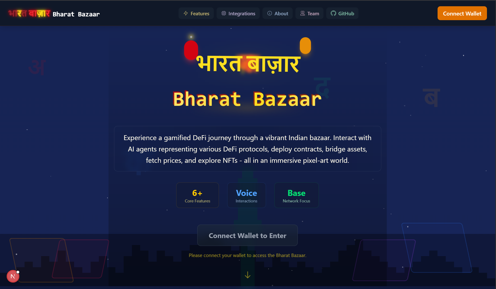
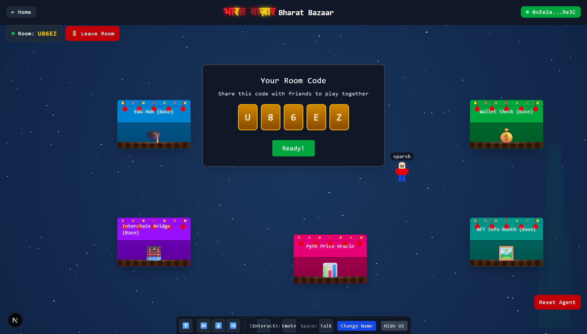

# BaseTone - Voice-Powered AI Metaverse on Base

**Submission for the Base Batches Global Buildathon - AI Track.**

<!-- Optional: Add your primary project image/logo here -->


BaseTone is an immersive metaverse experience where users interact with a voice-controlled AI agent to perform useful onchain actions on Base. It's our vision for the next wave of user-friendly, AI-driven onchain applications, designed to be a "killer onchain app."

[](https://www.youtube.com/watch?v=YOUR_VIDEO_ID_HERE)
*(Replace `YOUR_VIDEO_ID_HERE` with your actual YouTube video ID for the thumbnail and link)*

**Live Application:** [Link to your deployed BaseTone application]
*(Replace with your live URL)*

## Project Description

Navigating the onchain world can be complex. BaseTone simplifies this by introducing a voice-first AI agent within an engaging 2D pixel-art metaverse – the "Bharat Bazaar." Users can:

*   **Speak to Interact:** Use natural language to command the AI.
*   **Explore & Discover:** Move their character, find interactive stalls.
*   **Perform Onchain Actions:** Deploy contracts, check balances, bridge assets, get NFT info, and fetch real-time prices, all powered by our AI agent on Base.
*   **Connect with Others:** Experience the bazaar in real-time with friends in shared rooms.

<!-- Optional: Add a relevant screenshot or diagram here -->


## Key Features & Alignment with AI Track

BaseTone directly addresses the **AI Track** by featuring:

*   **AI Agent on Base:**
    *   Leverages **AgentKit** and OpenAI (GPT-4o-mini) for natural language understanding and action execution.
    *   Performs a variety of useful onchain actions via AgentKit providers (CDP, Wallet, Across, Pyth, OpenSea, Messari, DefiLlama).
    *   Context-aware: Understands its wallet, network (Base), and the specific stall/functionality the user is interacting with.
*   **Voice-Activated Commands & Text-to-Speech (TTS):** Seamless interaction using voice, with agent responses vocalized by ElevenLabs.
*   **Interactive Stalls:** Each stall (Edu Hub, Info Kiosk, Wallet Check, Bridge, Price Oracle, NFT Booth) provides a focused context for specific AI-driven onchain tasks.
*   **Real-time Multiplayer:** Shared experience with synchronized player movements, names, and emotes via Socket.IO.
*   **Seamless Onboarding & User Experience:**
    *   Easy wallet connection with Privy.
    *   Enhanced by **Coinbase Smart Wallet** capabilities, allowing users to perform transactions using human-readable names (e.g., "Send 0.1 ETH to `deepak.base.eth`" or "What's the balance of `alice.base.eth`?"), abstracting away complex wallet addresses for a smoother onchain experience.

## Tech Stack

*   **Frontend:** Next.js (v15), React (v19), TypeScript, Tailwind CSS, Privy, Wagmi, Socket.IO Client
*   **AI Agent Backend:** Node.js, Express.js, TypeScript, OpenAI API, **Coinbase AgentKit**, ElevenLabs API
*   **Socket Backend:** Node.js, Express.js, Socket.IO
*   **Blockchain:** Base (Mainnet for submission)

## Evaluation Criteria Fit

*   **Onchain:** Built on and for Base.
*   **Technicality:** Complex integration of AI, voice, real-time multiplayer, and various Web3 services via AgentKit.
*   **Originality:** Novel voice-first AI interaction model within a metaverse for onchain actions.
*   **Practicality:** Simplifies common Web3 tasks through natural language and user-friendly addressing.
*   **Aesthetics:** Engaging and intuitive pixel-art bazaar.
*   **Wow Factor:** The combination of a live, voice-controlled AI agent performing real onchain tasks in a shared virtual space.

## Getting Started

### Prerequisites

*   Node.js (v18+ or as specified in project)
*   pnpm (v9.15+ or as specified in project for frontend/socket-backend)
*   npm (for agent backend as per your installation steps)
*   Git

### Environment Setup

Create `.env` (or `.env.local` for frontend) files as described below for each service:

1.  **Agent Backend (`agent/.env`):**
    ```env
    PORT=3005
    OPENAI_API_KEY="your_openai_api_key"
    ELEVENLABS_API_KEY="your_elevenlabs_api_key"
    ELEVENLABS_VOICE_ID="your_elevenlabs_voice_id"
    CDP_API_KEY_NAME="your_cdp_api_key_name"
    CDP_API_KEY_PRIVATE_KEY="your_cdp_api_key_private_key_pem_string"
    BASE_NETWORK_ID="base-sepolia" # or base-mainnet
    # Optional: MESSARI_API_KEY, OPENSEA_API_KEY, WALLET_PRIVATE_KEY (for OpenSea), YOUR_ACTUAL_PRIVATE_KEY_FOR_ACROSS_IF_NEEDED_SEPARATELY
    ```
2.  **Frontend (`frontend/.env.local`):**
    ```env
    # For local development:
    NEXT_PUBLIC_PRIVY_APP_ID="your_privy_app_id_e.g_cm7ff4ltg029ubyp3c7kgd85m"
    NEXT_PUBLIC_SOCKET_IO_URL="http://localhost:3002"
    NEXT_PUBLIC_AGENT_BACKEND_URL="http://localhost:3005"

    # For production, these will be set in your hosting provider's environment variables.
    # Example:
    # NEXT_PUBLIC_PRIVY_APP_ID="your_privy_app_id_e.g_cm7ff4ltg029ubyp3c7kgd85m"
    # NEXT_PUBLIC_SOCKET_IO_URL="https://your-socket-backend.onrender.com"
    # NEXT_PUBLIC_AGENT_BACKEND_URL="https://your-agent-backend.onrender.com"
    ```
3.  **Socket Backend (`backend/.env`):**
    ```env
    PORT=3002
    ```

### Installation

1.  **Clone the repository:**
    ```bash
    git clone https://github.com/sparsh0006/BaseTone.git # Replace with your actual repo URL
    cd BaseTone
    ```

2.  **Install Agent Backend dependencies & build:**
    ```bash
    cd agent
    npm install
    npm run build
    cd ..
    ```

3.  **Install Frontend dependencies:**
    ```bash
    cd frontend
    pnpm install
    cd ..
    ```

4.  **Install Socket Backend dependencies:**
    ```bash
    cd backend
    pnpm install
    cd ..
    ```

### Running Locally

You need to run all three services concurrently. Open three separate terminal windows or tabs.

1.  **Start the Agent Backend (Terminal 1):**
    ```bash
    cd agent
    npm run dev
    ```
    *(Typically runs on `http://localhost:3005`)*

2.  **Start the Socket Backend (Terminal 2):**
    ```bash
    cd backend
    pnpm run dev
    ```
    *(Typically runs on `http://localhost:3002`)*

3.  **Start the Frontend (Terminal 3):**
    ```bash
    cd frontend
    pnpm run dev
    ```
    *(Typically runs on `http://localhost:3001`)*

Once all services are running, navigate to `http://localhost:3001` in your browser.


## License

This project is licensed under the [MIT License](https://opensource.org/licenses/MIT).
